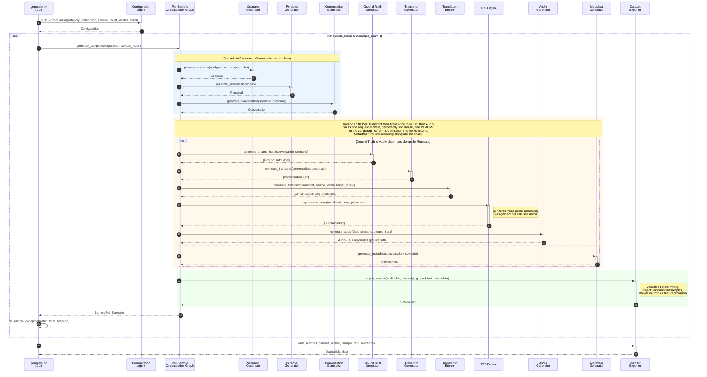

# Synthetic Threat Data Generator — Sequence Diagram

This diagram traces one `generate.py` CLI run through `generate_dataset(...)` in
[`src/orchestration/graph.py`](../../src/orchestration/graph.py): building the
`Configuration` once, then running the per-sample graph (`generate_sample`) in a
loop, and finally writing the dataset manifest once.

A high-resolution, infinitely-zoomable standalone SVG rendering of the same
diagram (generated via `mermaid-cli`) is available at
[`synthetic_data_gen_sequence-diagram.svg`](synthetic_data_gen_sequence-diagram.svg) —
open it directly in a browser and zoom to any level without quality loss.
The Mermaid source below renders natively in GitHub and VS Code.

## Diagram

## Reading notes

- **`build_configuration` and `write_manifest` are not graph nodes.**
  `generate_dataset` calls `configuration_agent.build_configuration(...)` once
  before the loop and `dataset_exporter_agent.write_manifest(...)` once after
  it — only the per-sample work inside the loop runs through the LangGraph
  `StateGraph`.
- **The Ground Truth → Transcript → Translation → TTS → Audio chain is
  deliberately sequential**, not parallel, even though Ground Truth
  Generation's own logic only reads `conversation`/`scenario` and never touches
  transcript data. This was a fix for a LangGraph limitation: `defer=True` is
  documented as "defer until the run is about to end," which works for exactly
  one terminal barrier node (`export`) — using it on two chained joins (`audio`
  and `export`) let `export` fire before `audio` had actually run. See the
  root [`README.md`](../../README.md) for the full writeup.
- **`Metadata` is the one branch that genuinely runs in parallel** with that
  chain, since it depends only on `conversation`.
- **Gendered TTS voice assignment** (alternating male/female per call, seeded
  deterministically via `stable_seed`, never both speakers landing on
  indistinguishable voices) happens inside `synthesize_turns` — see
  [`src/agents/tts_engine_agent.py`](../../src/agents/tts_engine_agent.py).
- **`on_sample_done`** is the CLI's progress callback, invoked once per
  completed sample so `generate.py --count N` prints live progress instead of
  appearing to hang during a multi-sample run.
