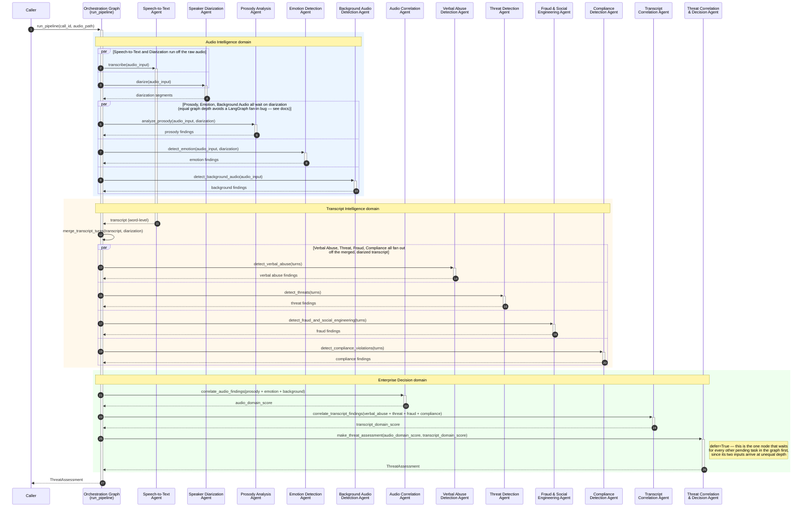

# Threat Detection System — Sequence Diagram

This diagram traces one call through `run_pipeline(call_id, audio_path)` in
[`src/orchestration/graph.py`](../../src/orchestration/graph.py), showing exactly which
agent function is invoked, in what order, and which calls run in parallel.

A high-resolution, infinitely-zoomable standalone SVG rendering of the same
diagram (generated via `mermaid-cli`) is available at
[`threat_detection_sequence-diagram.svg`](threat_detection_sequence-diagram.svg) —
open it directly in a browser and zoom to any level without quality loss.
The Mermaid source below renders natively in GitHub and VS Code.

## Diagram

## Reading notes

- **Three color-coded phases** mirror the three domains in the architecture doc:
  Audio Intelligence (blue), Transcript Intelligence (peach), and the Enterprise
  Decision layer (green).
- **`par ... and ... end` blocks** are genuine parallelism in the real
  `StateGraph` — not illustrative simplification. Prosody, Emotion, and
  Background Audio Detection are deliberately routed through Speaker
  Diarization (not `START` directly) so all three sit at equal graph depth;
  this sidesteps a LangGraph fan-in gotcha where a default join fires as soon
  as any one predecessor completes rather than waiting for all of them (see
  the root [`README.md`](../../README.md) for the full writeup).
- **`Decision` is the only `defer=True` node** in this graph — it is the single
  terminal barrier that waits for every other pending task, which is the one
  scenario `defer=True` is actually safe for.
- **`merge_transcript_turns`** is real orchestration logic (not a passthrough):
  it groups Speech-to-Text's word-level output into diarized turns using the
  Speaker Diarization Agent's segments, falling back to a single "unknown"
  speaker turn if diarization produced nothing.
